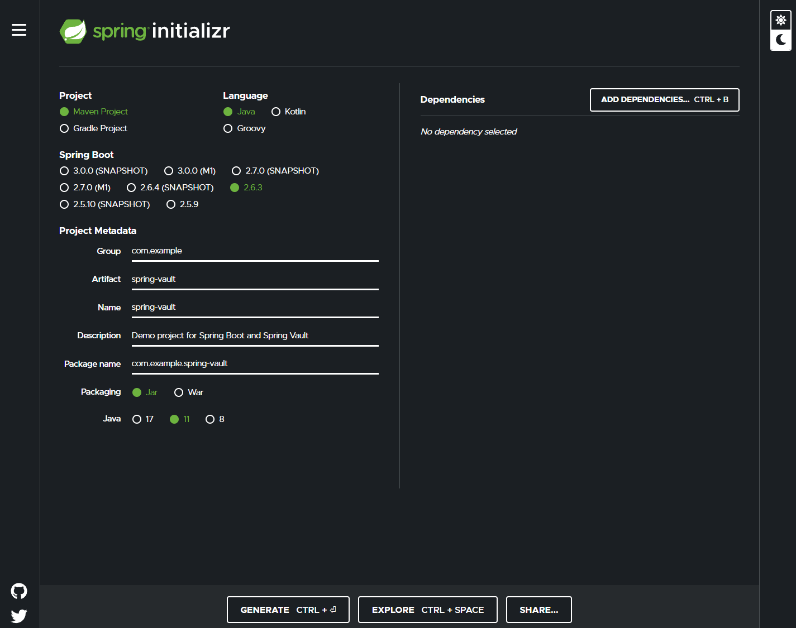

# spring-vault-example
Example repo showing how to use HashiCorp Vault with Spring Vault https://spring.io/projects/spring-vault

The first part of this guide follows the spring quick start [https://spring.io/quickstart](https://spring.io/quickstart)

## Creating a new repo

Create a new project using Spring Initializr



You can test that his works

**gradle**
```shell
./gradlew bootRun
```

**mvn**
```
./mnvw spring-boot:run
```

You should see something like the following if everything is working

```shell
[INFO] Attaching agents: []

  .   ____          _            __ _ _
 /\\ / ___'_ __ _ _(_)_ __  __ _ \ \ \ \
( ( )\___ | '_ | '_| | '_ \/ _` | \ \ \ \
 \\/  ___)| |_)| | | | | || (_| |  ) ) ) )
  '  |____| .__|_| |_|_| |_\__, | / / / /
 =========|_|==============|___/=/_/_/_/
 :: Spring Boot ::                (v2.6.3)

2022-02-16 15:21:19.587  INFO 22811 --- [           main] c.e.springvault.SpringVaultApplication   : Starting SpringVaultApplication using Java 11.0.13 on WINDOZE with PID 22811 (/home/nicj/go/src/github.com/hashicorp/spring-vault-example/target/classes started by nicj in /home/nicj/go/src/github.com/hashicorp/spring-vault-example)
2022-02-16 15:21:19.589  INFO 22811 --- [           main] c.e.springvault.SpringVaultApplication   : No active profile set, falling back to default profiles: default
2022-02-16 15:21:19.842  INFO 22811 --- [           main] c.e.springvault.SpringVaultApplication   : Started SpringVaultApplication in 0.453 seconds (JVM running for 0.607)
[INFO] ------------------------------------------------------------------------
[INFO] BUILD SUCCESS
[INFO] ------------------------------------------------------------------------
[INFO] Total time:  1.685 s
[INFO] Finished at: 2022-02-16T15:21:19Z
[INFO] ------------------------------------------------------------------------
```

## Add a new endpoint to Spring boot app

Now that things are running, lets add a simple endpoint to the Spring init java app.

Modify the SpringVaultApplication class in `./src/main/java/com/example/spring-vault/SpringVaultApplication.java` to add the following
handler.

```java
@GetMapping("/hello")
public String hello(@RequestParam(value = "name", defaultValue = "World") String name) {
  return String.format("Hello %s!", name);
}
```

You will also need to add the the following imports

```
import org.springframework.web.bind.annotation.GetMapping;
import org.springframework.web.bind.annotation.RequestParam;
import org.springframework.web.bind.annotation.RestController;
```

And mark the spring boot application as a rest controller by adding the following class annotation:

```
@RestController
```

Your application code should now look like the following example

```java
package com.example.demo;

import org.springframework.boot.SpringApplication;
import org.springframework.boot.autoconfigure.SpringBootApplication;
import org.springframework.web.bind.annotation.GetMapping;
import org.springframework.web.bind.annotation.RequestParam;
import org.springframework.web.bind.annotation.RestController;

@SpringBootApplication
@RestController
public class DemoApplication {

  public static void main(String[] args) {
    SpringApplication.run(DemoApplication.class, args);
  }

  @GetMapping("/hello")
  public String hello(@RequestParam(value = "name", defaultValue = "World") String name) {
    return String.format("Hello %s!", name);
  }
```

Let's check that this is all running

Run the application

**gradle**
```shell
./gradlew bootRun
```

**mvn**
```
./mnvw spring-boot:run
```

Now curl the endpoint

```shell
➜ curl localhost:8080/hello

You should see... 

```shell
Hello World!
```

## Adding Vault secrets